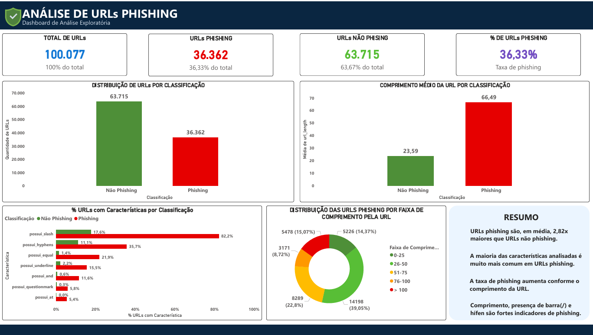

# Projeto de Análise de Phishing em Páginas Web

Este projeto de portfólio é voltado para análise de dados utilizando SQL. O trabalho investiga quais características das URLs apresentam maior associação com páginas classificadas como phishing.

## 📌 Sobre o projeto

Phishing envolve páginas falsas ou fraudulentas criadas para tentar enganar usuários e obter informações. A análise realizada neste projeto ajuda a entender padrões presentes no conjunto de dados.

## 🎯 Objetivo

O objetivo é utilizar SQL para explorar e analisar os dados e responder às perguntas de negócio propostas no projeto.

## 📌 Status do projeto

> **Concluído — análise exploratória realizada em SQL.**

## ❓ Perguntas de negócio

1. Quais características apresentam maior e menor associação com a classificação `phishing`?
2. O comprimento da URL é um indicador relevante para identificar URLs classificadas como phishing?
3. O número de redirecionamentos é um indicador relevante para identificar URLs classificadas como phishing?
4. Quais recomendações podem ser obtidas a partir da análise das características das URLs?

## 📊 Dados utilizados

Foi utilizado o **Web Page Phishing Dataset**.

Os dados contêm informações sobre características das URLs e uma variável `phishing`, utilizada para indicar a classificação da URL. Para a análise, os dados foram organizados em três tabelas conforme a proposta do projeto.

O CSV original apresenta algumas diferenças de nomenclatura em relação às tabelas utilizadas no projeto: `n_hypens` foi padronizado como `n_hyphens`, e `n_hastag` foi padronizado como `n_hashtag`. Os nomes foram ajustados nas tabelas SQL para seguir a estrutura definida na proposta do projeto.

O campo `unique_id` foi utilizado como chave de relacionamento entre as tabelas conforme a proposta do exercício, embora não faça parte do cabeçalho original do CSV.

Fonte: [Web Page Phishing Dataset - Kaggle](https://www.kaggle.com/datasets/danielfernandon/web-page-phishing-dataset)

## 🗄️ Estrutura dos dados

Conforme a proposta do projeto, os dados foram trabalhados em três tabelas:

### `web_page_fishing`

Contém:

- `unique_id`
- `url_length`
- `n_redirection`
- `phishing`

### `phishing_dataset`

Contém:

- `unique_id`
- `n_dots`
- `n_hyphens`
- `n_underline`
- `n_slash`
- `n_questionmark`
- `n_equal`
- `n_at`
- `n_and`
- `n_exclamation`
- `n_space`
- `n_tilde`
- `n_comma`
- `n_plus`
- `n_asterisk`
- `n_hashtag`
- `n_dollar`
- `n_percent`

As tabelas são relacionadas pelo campo `unique_id`.

### `phishing_características`

Contém características utilizadas nas análises do projeto.

## 📊 Dashboard

O dashboard foi desenvolvido no Power BI para apresentar os principais resultados da análise de forma visual.



O dashboard apresenta:

- distribuição das URLs por classificação;
- comprimento médio das URLs por classificação;
- presença de características por classificação;
- distribuição das URLs phishing por faixa de comprimento.

## 🔎 Análises realizadas

As consultas foram separadas na pasta `SQL` de acordo com o fluxo do projeto. Cada arquivo representa uma etapa da análise:

| Arquivo | Objetivo |
|---|---|
| `SQL/01_exploracao.sql` | Exploração inicial dos dados, com quantidade de registros, visualização inicial e distribuição das classificações. |
| `SQL/02_analise_descritiva.sql` | Comparação entre URLs phishing e não phishing, incluindo tamanho médio e redirecionamentos. |
| `SQL/03_analise_caracteristicas.sql` | Análise das características presentes nas URLs e comparação entre os grupos. |
| `SQL/04_analises.sql` | Análise de correlação, comprimento da URL, redirecionamentos e pontuação de suspeita. |

As consultas seguem uma sequência lógica: exploração inicial → análise descritiva → análise das características → análises finais.

---

## 📈 Principais resultados

### Correlação

| Campo | Correlação com phishing |
|---|---:|
| `n_slash` | 0.6115 |
| `url_length` | 0.4301 |
| `n_equal` | 0.2605 |
| `n_and` | 0.1892 |
| `n_dots` | 0.1819 |
| `n_underline` | 0.1683 |
| `n_questionmark` | 0.1670 |
| `n_hyphens` | 0.1504 |
| `n_at` | 0.1091 |
| `n_redirection` | -0.0508 |
| `n_tilde` | 0.0496 |
| `n_exclamation` | 0.0294 |
| `n_comma` | 0.0265 |
| `n_percent` | 0.0261 |
| `n_dollar` | 0.0258 |
| `n_asterisk` | 0.0191 |
| `n_space` | 0.0148 |
| `n_hashtag` | 0.0103 |
| `n_plus` | 0.0066 |

`n_slash` apresentou a maior associação (**0.6115**). `n_plus` apresentou a menor associação em valor absoluto (**0.0066**), enquanto `n_redirection` apresentou o menor valor numérico da tabela (**-0.0508**). Correlação indica associação, não causalidade; portanto, não permite afirmar que uma característica cause phishing.

### Pontuação de suspeita

| Pontuação | Total de URLs | Total phishing | % phishing |
|---:|---:|---:|---:|
| 0 | 49079 | 2684 | 5.47% |
| 1 | 27556 | 14492 | 52.59% |
| 2 | 11611 | 8711 | 75.02% |
| 3 | 5209 | 4178 | 80.21% |
| 4 | 3282 | 3018 | 91.96% |
| 5 | 2387 | 2339 | 97.99% |
| 6 | 953 | 940 | 98.64% |

Na regra de pontuação criada no projeto, observou-se uma proporção maior de URLs classificadas como phishing conforme a pontuação aumentou. O cálculo considera algumas características e o comprimento da URL, conforme a consulta existente.

> **Observação:** a pontuação é exclusivamente exploratória. Não representa um modelo de Machine Learning, um sistema oficial de detecção, uma ferramenta de segurança ou uma classificação definitiva de URLs.

### Comprimento e redirecionamentos

| Indicador | Resultado | Interpretação |
|---|---:|---|
| Comprimento da URL | 0.4301 | Associação relevante |
| Redirecionamentos | -0.0508 | Associação muito próxima de zero |

`url_length` apresentou correlação de **0.4301**, indicando uma associação relevante nos dados analisados. Ainda assim, o comprimento sozinho não determina se uma URL é phishing, e URLs longas não são necessariamente phishing.

Para `n_redirection`, a correlação foi **-0.0508**, muito próxima de zero. Assim, esse indicador não se mostrou forte nesta análise, limitada ao conjunto de dados utilizado; isso não significa que redirecionamentos nunca estejam relacionados a phishing.

## 💡 Conclusão

A análise indicou maior associação com a classificação de phishing para `n_slash` e `url_length`. Embora o comprimento da URL tenha apresentado uma associação relevante, ele não deve ser utilizado isoladamente. `n_redirection` apresentou correlação próxima de zero, reforçando a importância de considerar várias características e outros fatores na interpretação dos resultados.

## 🔎 Recomendações

Com base na análise, algumas atitudes podem ajudar na avaliação de URLs suspeitas:

- observar o comprimento da URL;
- prestar atenção à presença e à quantidade de determinados caracteres;
- desconfiar de URLs com características incomuns;
- não confiar em apenas um indicador;
- verificar cuidadosamente o domínio antes de inserir informações pessoais;
- quando houver dúvida, acessar o serviço diretamente por um endereço conhecido em vez de clicar em links suspeitos.

## 🛠️ Tecnologias utilizadas

Tecnologias:

`MySQL` · `SQL` · `Power BI` · `MySQL Workbench` · `Visual Studio Code`

## 📂 Estrutura do projeto

```text
Projeto-Phishing/
│
├── SQL/
│   ├── 01_exploracao.sql
│   ├── 02_analise_descritiva.sql
│   ├── 03_analise_caracteristicas.sql
│   └── 04_analises.sql
│
├── Dashboard/
│   └── Dashboard_Phishing.png
│
├── web-page-phishing.csv
└── README.md
```

A pasta `SQL` concentra todas as consultas utilizadas no projeto.

## 📚 Aprendizados

O projeto permitiu praticar consultas SQL e aplicar:

- `SELECT`, `COUNT`, `AVG`, `SUM` e `CASE`;
- `GROUP BY`, `ORDER BY`, `INNER JOIN` e CTEs com `WITH`;
- funções de agregação e análise exploratória de dados;
- interpretação de correlação;
- transformação de uma pergunta de negócio em uma análise SQL.

## ⚠️ Observações

Os resultados são referentes ao conjunto de dados analisado e às regras utilizadas neste projeto. A interpretação deve considerar diferentes fatores e não apenas uma característica isolada.

## 🔗 Fonte dos dados

[Web Page Phishing Dataset - Kaggle](https://www.kaggle.com/datasets/danielfernando/web-page-phishing-dataset)
